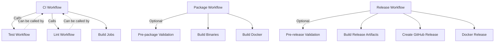

# CI/CD Workflows

This directory contains simplified CI/CD workflows that can be run independently or together.

## Available Workflows

### 🔄 Core Workflows

#### 1. **CI Workflow** (`ci.yml`)
**Trigger:** Push to main, Pull requests, Manual
**Purpose:** Complete continuous integration pipeline

**Jobs:**
- `vet` - Go vet static analysis ✅ **Blocking**
- `fmt` - Go format checking ✅ **Blocking** 
- `lint` - golangci-lint (non-blocking warnings)
- `security` - gosec security scan (non-blocking)
- `test` - Cross-platform tests ✅ **Blocking**
- `integration` - Integration tests (PR label conditional)
- `build` - Cross-platform builds ✅ **Blocking**
- `docker-build` - Docker build test
- `benchmark` - Performance benchmarks (PR label conditional)
- `ci-success` - Final status check

#### 2. **Package Workflow** (`package.yml`)
**Trigger:** Code changes, Manual
**Purpose:** Build and package binaries and Docker images

**Features:**
- ✅ **Independent execution** - Can skip tests with `skip_tests=true`
- Multi-platform binary builds (Linux, macOS, Windows - amd64/arm64)
- Docker multi-arch images (linux/amd64, linux/arm64)
- Artifact upload with 7-day retention
- Version tagging support

**Manual Usage:**
```bash
# Via GitHub UI: Actions → Package → Run workflow
# Options:
# - version: Custom version (e.g., v1.0.0)
# - skip_tests: Skip validation tests
```

#### 3. **Release Workflow** (`release.yml`)
**Trigger:** Git tags (`v*`), Manual
**Purpose:** Create GitHub releases with all artifacts

**Features:**
- ✅ **Independent execution** - Can skip tests with `skip_tests=true`
- Automatic changelog generation
- Multi-platform release binaries
- Docker image publishing to GHCR
- GitHub release creation
- Prerelease detection and handling

**Manual Usage:**
```bash
# Via GitHub UI: Actions → Release → Run workflow
# Options:
# - tag: Version tag (e.g., v1.0.0)
# - prerelease: Mark as prerelease
# - skip_tests: Skip validation tests
```

### 🛠️ Standalone Workflows

#### 4. **Lint Workflow** (`lint.yml`)
**Trigger:** Manual, Callable
**Purpose:** Run all linting and static analysis

**Jobs:**
- `golangci-lint` - Comprehensive linting
- `go-fmt` - Format checking ✅ **Blocking**
- `go-vet` - Static analysis ✅ **Blocking**  
- `gosec` - Security scanning
- `lint-summary` - Combined results

#### 5. **Test Workflow** (`test.yml`)
**Trigger:** Manual, Callable
**Purpose:** Run comprehensive test suite

**Features:**
- Configurable Go version and OS
- Unit, integration, and benchmark tests
- Coverage reporting
- Flexible execution options

**Manual Usage:**
```bash
# Via GitHub UI: Actions → Test → Run workflow
# Options:
# - go_version: Go version (default: 1.24)
# - os: Target OS (all, ubuntu-latest, macos-latest, windows-latest)
# - coverage: Generate coverage report (default: true)
```

## Workflow Dependencies



## Usage Scenarios

### 🚀 **Quick Package** (Skip Tests)
When you need to package quickly due to linting issues:
```bash
1. Go to Actions → Package → Run workflow
2. Set skip_tests: true
3. Optionally set version
4. Run workflow
```

### 🏷️ **Quick Release** (Skip Tests)
When you need to release quickly:
```bash
1. Go to Actions → Release → Run workflow  
2. Set tag: v1.0.0
3. Set skip_tests: true
4. Run workflow
```

### 🔍 **Lint Only**
Fix linting issues separately:
```bash
1. Go to Actions → Lint → Run workflow
2. Review results
3. Fix issues locally
4. Re-run as needed
```

### 🧪 **Test Specific Configuration**
Test specific scenarios:
```bash
1. Go to Actions → Test → Run workflow
2. Configure:
   - go_version: 1.23
   - os: windows-latest
   - coverage: false
3. Run workflow
```

## Branch Protection

The following jobs are **required** for merging to main:
- `ci-success` (from CI workflow)

Optional jobs (warnings only):
- `lint` results
- `security` scan results
- `benchmark` results

## Tips

1. **Use manual triggers** when you need to bypass certain checks
2. **Package workflow** is perfect for testing distribution before release
3. **Standalone workflows** help isolate and fix specific issues
4. **Skip tests option** is useful when you know tests pass but have linting issues
5. **Coverage reports** are automatically uploaded to Codecov from Ubuntu/Go 1.24 runs

## Artifact Retention

- **Package artifacts**: 7 days
- **Release artifacts**: Permanent (attached to GitHub release)
- **Docker images**: Managed by GHCR retention policies